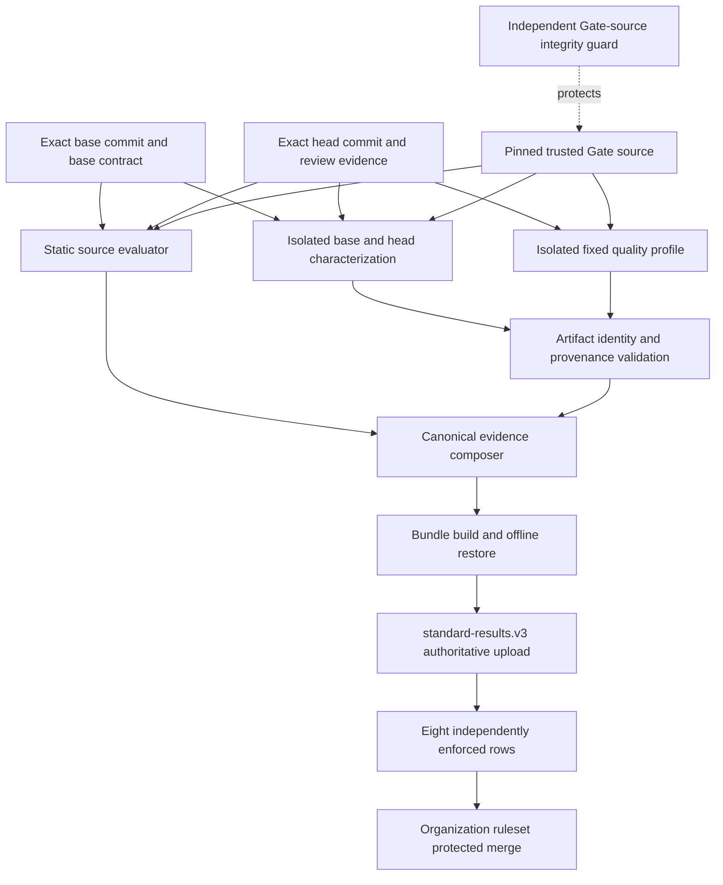

# Architecture

The design separates immutable repository facts, isolated target execution, authenticated evidence,
deterministic decisions, and GitHub's merge enforcement.

## Trust boundaries

1. **Source facts:** full Git SHAs and immutable blobs establish exactly what is being evaluated.
   Candidate contract bytes can expose weakening but cannot replace base authority in that change.
2. **Static evaluation:** the Gate parses target source and supported import graphs. It does not
   import target modules as part of static policy evaluation.
3. **Hosted execution:** a supervisor provisions fixed dependencies and tools. Target-native
   commands run in an immutable-image, read-only, no-network container with bounded resources,
   restricted privileges, and a dedicated writable work area. Source, trusted tools, collectors,
   and authoritative evidence are not target-writable.
4. **Authentication:** output becomes qualified evidence only through defined identity, provenance,
   receipt, coverage, and artifact validation. Raw target output is not self-authenticating.
5. **Composition and enforcement:** one canonical result contains eight independently owned rows.
   Separate jobs enforce each row against the exact artifact. GitHub owns branch protection and
   the final protected merge path.
6. **Source protection:** an independently pinned Source Integrity workflow protects the Gate's
   immutable inputs and source qualification controls. Candidate-controlled tests do not supply
   its trusted conformance fixture.

## Responsibility boundaries

GitHub owns events, organization assignment, required workflows, status checks, native review
threads, and merge blocking. Existing language-native tools own lint, format, typing, tests, builds,
and measurements. The Gate owns fixed policy interpretation, base/head comparison, coverage,
anti-weakening, evidence requirements, validation, and canonical decisions.

Repository names bind identity and enrollment; the policy uses committed profile and scope rather
than a consumer-specific branch. The package's declared dependency graph is enforced by the
Import Linter contract in [pyproject.toml](../../pyproject.toml).

See [Module Map](Module-Map.md) for source responsibilities and [Validation and Protection](Validation-and-Protection.md)
for the difference between consumer checks and Gate-source protection.

Implementation references: [static entrypoint](../../src/supportability_gate/cli.py),
[execution sandbox](../../src/supportability_gate/quality_runner.py),
[composition](../../src/supportability_gate/standard_results.py), and
[source guard](../../tests/source_integrity_check.py).
