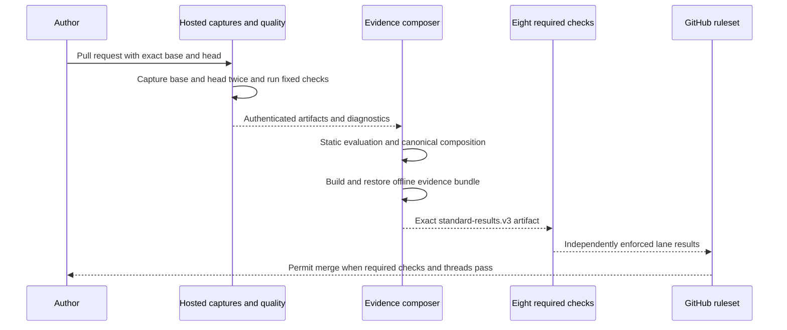

# Pull Request Lifecycle

## From change to merge

1. **Prepare the change.** Keep the base contract authoritative, refresh the review evidence, and
   preserve or explicitly migrate the applicable characterization obligations. Include meaningful
   tests for changed and high-risk responsibilities.
2. **Bind owner authorization when required.** The existing format must match the current base,
   head, changed scope, targets, and series. [Refactor Authorization](Refactor-Authorization.md)
   explains the exact trusted-owner boundary.
3. **Run the pinned workflow.** GitHub checks out immutable target commits and trusted Gate source
   separately. Fixed dependency provisioning occurs under the hosted supervisor; target execution
   occurs inside the defined isolated container boundary.
4. **Capture and authenticate evidence.** Scenarios run twice at each revision. Quality execution
   retains fixed command vectors, outcomes, source and dependency receipts, and observed coverage.
   Artifact metadata and digests must match repository, commits, workflow, run, and attempt.
5. **Evaluate and compose.** Static parsing and the policy modules produce canonical evidence.
   The composer produces eight rows in `standard-results.v3` and a derived review handoff.
6. **Retain a restorable bundle.** The evidence job builds a compact qualification bundle and
   validates restoration with networking disabled before authoritative upload succeeds.
7. **Inspect each required lane.** Independent jobs enforce one row each from the authoritative
   artifact. Read the owning violation or original technical cause rather than counting red checks.
8. **Merge normally.** All required checks must bind to the final head and all actual inline
   conversations must satisfy GitHub's native resolution rule. Source-repository protections apply
   additionally when the change is to the Gate itself.

## What a new push changes

A new head creates a new evidence identity. Refresh source-bound declarations and any required
owner authorization; obtain fresh captures and checks. Earlier green results, archived bundles,
or local runs cannot qualify the new head.

## Short tasks and advisory review

Only the exact narrow [short-task classifier](Boundaries-and-Limitations.md#short-task-classification)
permits irrelevant lanes to report `NOT_APPLICABLE_SHORT_TASK`. Gate 7 still runs. Ordinary
documentation edits do not automatically qualify for the exception.

Codex review is optional, owner-requested advisory input and is not a required check. Any inline
conversation it creates remains subject to native thread resolution. Semantic Review is retired.

Implementation references: [required workflow](../../.github/workflows/organization-required.yml),
[producer](../../src/supportability_gate/standard_results_producer.py), and
[enforcer](../../src/supportability_gate/standard_results_enforcer.py).
